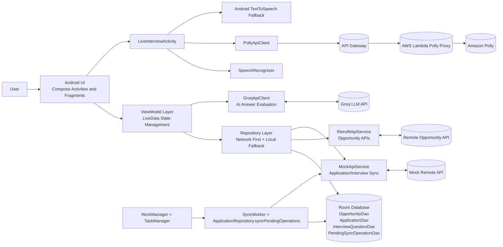
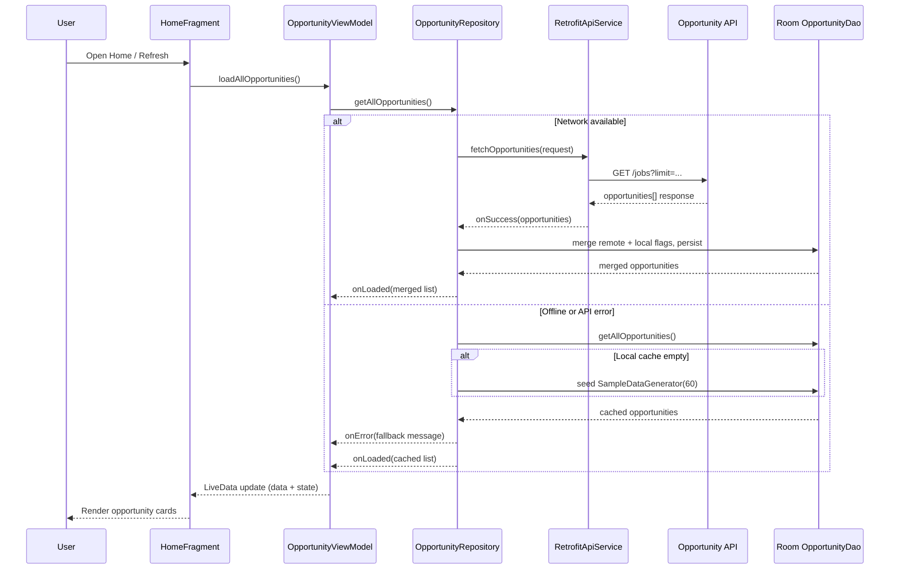
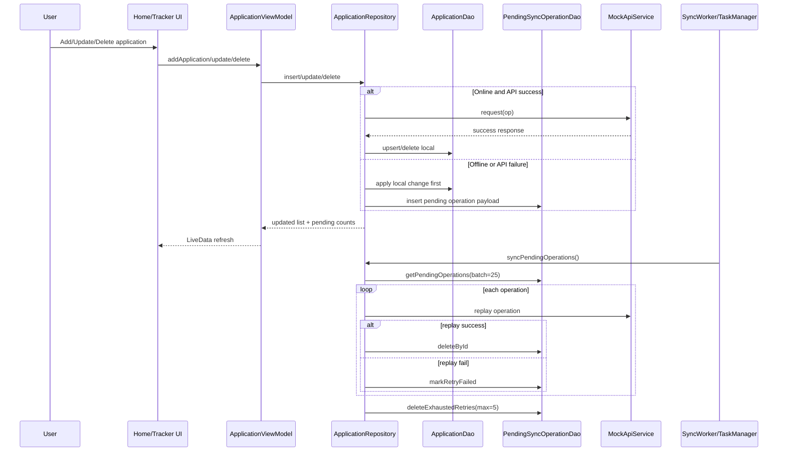
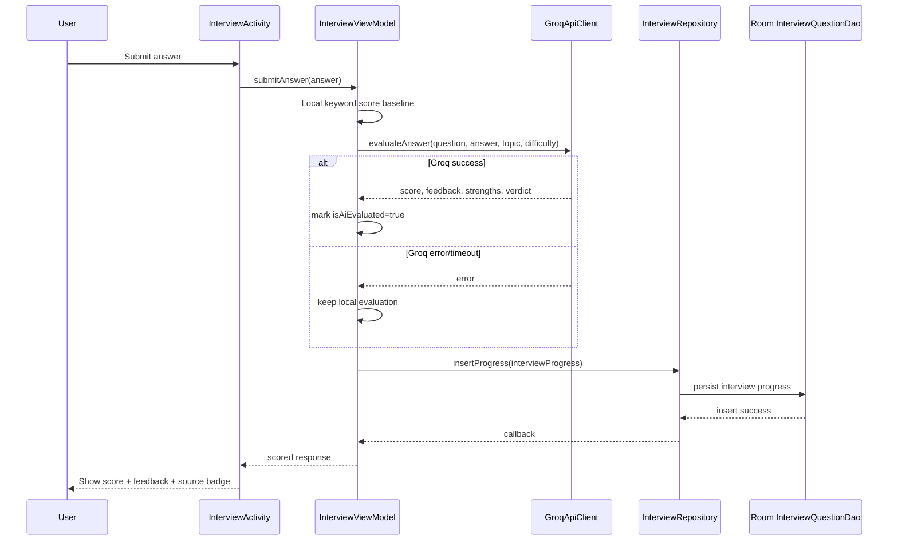
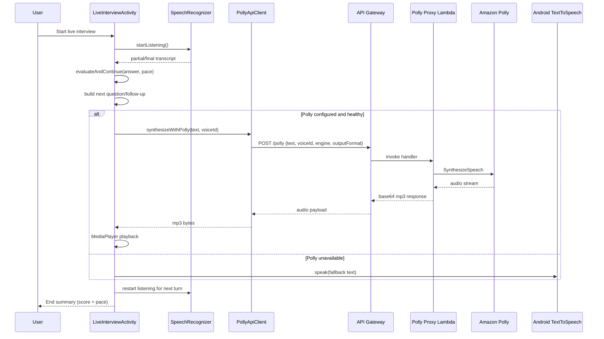

# OPPORTUNITYHUB: AN INTEGRATED MOBILE APPLICATION FOR OPPORTUNITY DISCOVERY, APPLICATION TRACKING, AND AI-ASSISTED INTERVIEW PREPARATION

## ABSTRACT
This report presents OpportunityHub, an Android application designed to solve a common problem for students and early professionals: opportunity discovery, application management, and interview preparation are usually fragmented across multiple platforms. The proposed system unifies internship/job/hackathon discovery, profile-aware recommendations, saved opportunity management, application pipeline tracking, analytics, and AI-assisted interview practice in a single mobile workflow. The implementation follows an MVVM-based architecture with Room for local persistence, WorkManager for periodic background tasks, Retrofit/OkHttp for network integration, and a hybrid interview evaluation pipeline that supports both local scoring and AI-backed feedback. The system also supports a live interview mode with speech recognition, interviewer voice playback, optional Amazon Polly proxy synthesis, and follow-up prompting. To improve reliability in unstable network conditions, the application uses local-first persistence and pending sync operation queues with retry control. The project demonstrates that a carefully integrated mobile-first solution can improve user continuity from opportunity discovery to interview readiness while remaining practical for resource-constrained and intermittently connected environments.

## KEYWORDS
Android application, opportunity recommendation, AI interview preparation, MVVM, Room database, WorkManager, offline-first sync, career analytics

## 1 INTRODUCTION

In current student and entry-level job ecosystems, internship and job opportunities are distributed across many websites and social channels. Users typically face three disconnected workflows:

1. Discovering relevant opportunities.
2. Tracking applications and deadlines.
3. Preparing for interviews.

When these workflows are not unified, users often lose momentum, miss deadlines, or prepare inconsistently for technical and behavioral interviews. Existing platforms may be strong in one area (for example, listings or coding practice), but they rarely provide an integrated end-to-end experience optimized for mobile usage.

OpportunityHub addresses this gap by combining opportunity discovery, recommendation, tracking, and interview preparation in one Android application.

### Research Gap (Broad)
The reviewed ecosystem reveals a practical integration gap:

1. Opportunity platforms focus on listing and search but provide limited structured application tracking.
2. Tracking tools generally do not include intelligent recommendation or profile-aware ranking.
3. Interview preparation tools are detached from actual application pipeline state.
4. Many solutions do not provide robust offline-first behavior for unstable connectivity.

### Research Question
How can an Android application integrate opportunity discovery, recommendation, tracking, and AI interview preparation in a single user flow while preserving usability and operational reliability under variable network conditions?

### Research Objectives
1. Build a unified mobile workflow for discovering, saving, applying, and tracking opportunities.
2. Design and implement a profile-aware recommendation mechanism for ranking opportunities.
3. Provide interview preparation through question banks, answer evaluation, readiness metrics, and live interview simulation.
4. Support reliability through local persistence, background synchronization, and fallback mechanisms.
5. Provide analytics and export features for user decision support.

### Research Contribution
This work contributes an integrated, production-style Android architecture that combines:

1. Multi-factor opportunity recommendation.
2. Offline-first data handling with queued sync operations.
3. AI-assisted and local fallback interview evaluation.
4. Live voice interview interaction with speech and optional Polly-based synthesis.
5. Application analytics and CSV export for user-level review.

### Paper Roadmap
Section 2 reviews related work and articulates the research gap. Section 3 defines objectives. Section 4 explains design and methodology. Section 5 discusses societal and environmental contribution. Section 6 presents advanced concepts used. Section 7 reports results and discussion. Section 8 concludes. Section 9 states limitations. Section 10 outlines future scope. Section 11 lists references. Section 12 provides author details.

## 2 LITERATURE SURVEY

### 2.1 Literature Summary

The current ecosystem includes opportunity portals, coding preparation tools, interview simulators, and productivity trackers. However, integration remains limited.

| Source / Platform | Core Strength | Typical Limitation Relative to This Study |
|---|---|---|
| LinkedIn Jobs | Large professional network and listing coverage | Tracking and interview preparation are not deeply integrated into one closed-loop flow |
| Indeed | Broad job discovery with search filters | Personal readiness coaching and interview simulation are limited |
| Internshala | Internship-focused discovery for students | End-to-end interview preparation and analytics are not tightly coupled |
| HackerEarth / Devpost | Hackathon discovery and participation | Multi-category pipeline tracking (job + internship + hackathon) is usually external |
| LeetCode / HackerRank | Strong technical problem practice | Application workflow integration is absent |
| Pramp / mock interview tools | Interview simulation | Opportunity recommendation and application tracking are external |
| Generic task/reminder apps | Deadline and reminder management | No domain-specific recommendation and interview intelligence |
| Career spreadsheets/manual tracking | Full user control | High maintenance overhead, no intelligent ranking, no real-time feedback |

### 2.2 Analysis of Research Gap

The survey indicates multiple unresolved gaps:

1. **Methodological Gap:** Existing tools optimize isolated modules (listings, tracking, or interview prep), not a complete pipeline.
2. **Practical-Knowledge Gap:** Users need one mobile workflow that transitions from discovery to interview execution without context switching.
3. **Evidence Gap:** Offline-first behavior with queue-based sync and retry strategies is underemphasized in student career tools.
4. **Usability Gap:** Voice-interactive interview rehearsal with fallback behavior is uncommon in mainstream student-focused apps.

This project addresses these gaps through a unified architecture and implementation that connects all stages in one application lifecycle.

## 3 OBJECTIVE

1. Develop an Android platform that centralizes internships, jobs, and hackathons.
2. Rank opportunities using profile-aware recommendation scoring.
3. Provide searchable and filterable lists with save/apply actions.
4. Track application statuses across pipeline states (saved, applied, interview, rejected, accepted).
5. Build an AI interview module with domain selection, scoring, and readiness tracking.
6. Provide a live interview mode with speech recognition, speaking pace estimation, follow-up prompts, and interviewer voice output.
7. Ensure reliability with Room persistence, periodic workers, and pending sync operation retry logic.
8. Provide analytics and export capabilities for user review.

## 4 DESIGN AND METHODOLOGY

### 4.1 Software Requirements (SR)

1. Android Studio and Gradle-based Android build pipeline.
2. Java 17 and Kotlin interoperability.
3. Android SDK (minSdk 24, target/compile SDK configured in project).
4. Room database for local persistence.
5. Retrofit and OkHttp for API integration.
6. WorkManager for periodic sync and notifications.
7. Compose + Material 3 UI components.
8. CameraX and Android Speech APIs for live interview mode.

### 4.2 System Architecture

The project follows MVVM with a repository abstraction:

1. **View Layer:** Compose-based activities/fragments for Home, Saved, Tracker, AI Interview, Roadmap, Analytics, and Profile.
2. **ViewModel Layer:** State management, filtering, scoring injection, and UI orchestration.
3. **Repository Layer:** Network-first retrieval with local fallback, write-through updates, and merge logic.
4. **Persistence Layer:** Room entities for opportunities, applications, interview data, user profile, and pending sync operations.
5. **Worker Layer:** Periodic sync, daily recommendation notifications, and deadline reminders.

### 4.3 Dataset and Data Generation Strategy

1. Opportunity generation supports a curated+randomized pool, including internships, jobs, and hackathons.
2. Local fallback seeding inserts 60 opportunities when cache is empty.
3. Full synthetic generation utilities support larger pools (up to 120 in utility methods).
4. Interview question datasets are domain-specific (SDE, ML, Web, Android, HR) with topic, difficulty, expected keywords, and sample answers.

### 4.4 Recommendation Methodology

Recommendation combines multiple weighted signals:

1. Role/type match.
2. Location match.
3. Paid preference match.
4. Skill matches.
5. Remote preference.
6. Deadline proximity (in preference-mode path).

Score-derived outputs:

1. Recommendation ranking values stored per opportunity.
2. Match percentage injected for UI display.
3. Top-N selection used for recommended sections and notifications.

### 4.5 Interview Evaluation Methodology

The interview pipeline supports two evaluation modes:

1. **AI Evaluation Mode:** Uses remote evaluation client for score, feedback, strengths, improvements, and verdict.
2. **Local Fallback Mode:** Keyword overlap and answer quality heuristics when AI evaluation is unavailable.

Live interview mode includes:

1. Speech recognition with partial/final transcript handling.
2. Non-answer retry strategy with controlled thresholds.
3. Follow-up question generation when response depth is insufficient.
4. Speaking pace estimate using words-per-minute.
5. Voice output using Polly proxy when configured, with automatic TTS fallback.

### 4.6 Offline Sync and Reliability Methodology

1. Application writes are attempted online first when possible.
2. On offline/error conditions, writes persist locally and enqueue pending operations.
3. Pending operations maintain retry metadata and error context.
4. Background sync attempts replay operations in batches and removes successful entries.
5. Sync workers and task schedulers provide periodic recovery.

### 4.7 High-Level Algorithmic Pseudocode

**Algorithm 1: Opportunity Ranking**

Input: Opportunity list O, User profile P  
Output: Ranked list R

1. For each opportunity o in O:
2. Compute score s from weighted matches (role, location, paid, skills, remote).
3. Set o.recommendationScore = s.
4. Compute and set o.matchPercentage.
5. Sort O by recommendationScore descending.
6. Return top-ranked list R.

**Algorithm 2: Interview Evaluation with Fallback**

Input: Question q, Answer a  
Output: Evaluation e

1. If a is blank, return low-score feedback.
2. Attempt AI evaluation.
3. If AI succeeds, persist AI result.
4. Else compute local keyword/heuristic score.
5. Generate verdict and improvement suggestions.
6. Persist progress and update readiness metrics.

### 4.8 Request-Response Process Flow Architecture

This subsection provides report-ready architecture flow designs showing how request/response cycles move through UI, ViewModel, repository, local storage, and external services.

### 4.8.1 End-to-End Component Interaction

### 4.8.2 Sequence A: Opportunity Discovery Request/Response

### 4.8.3 Sequence B: Application Write + Offline Sync Queue

### 4.8.4 Sequence C: AI Interview Evaluation (AI + Local Fallback)

### 4.8.5 Sequence D: Live Interview Voice Loop (STT to Polly/TTS)

### 4.8.6 Request/Response Contract Snapshot

| Flow | Request | Response | Fallback Behavior |
|---|---|---|---|
| Opportunity fetch | `GET opportunities` via RetrofitApiService | `List<Opportunity>` | Load cached Room data; seed local sample if empty |
| Application write | `insert/update/delete application` via MockApiService | success/fail callback | Write local first and enqueue `pending_sync_operations` |
| Pending sync replay | batched replay of queued operations | per-op success/fail | increment retry count; remove after max retries |
| Interview evaluation | `evaluateAnswer(question, answer, topic, difficulty)` via GroqApiClient | score, feedback, strengths, improvements, verdict | use local keyword-based evaluation |
| Polly synthesis | `POST /polly` body: text, voiceId, engine, outputFormat | base64 MP3 audio (`audio/mpeg`) | fallback to Android TextToSpeech |

These flows ensure a resilient mobile-first architecture where user-visible actions always produce timely local responses, even when remote services fail.

### 4.9 API Endpoint Inventory

This subsection lists the endpoint surface currently used by the application and classifies each endpoint by purpose, request shape, response contract, authentication model, and owning module.

### 4.9.1 HTTP Endpoint Inventory (Implemented)

| Endpoint ID | Base URL | Path | Method | Purpose | Request Contract | Response Contract | Auth | Consumed By |
|---|---|---|---|---|---|---|---|---|
| OPP-LIST-01 | `https://remotive.com` | `/api/remote-jobs` | `GET` | Fetch remote job opportunities and search results | Query params: `limit` (int), `search` (string, optional) | JSON with `jobs[]`; mapped to `Opportunity` model in app | None | `RetrofitApiService` via `OpportunityRepository` |
| AI-EVAL-01 | `https://api.groq.com` | `/openai/v1/chat/completions` | `POST` | Evaluate interview answers and support stateful interview conversation | JSON body: `model`, `messages[]`, `max_tokens`, `temperature` | JSON `choices[0].message.content`; parsed into score/feedback/verdict for interview evaluation | Bearer token (`GROQ_API_KEY`) | `GroqApiClient` via `InterviewViewModel` |
| TTS-POLLY-01 | `https://<api-id>.execute-api.<region>.amazonaws.com` | `/polly` | `POST` | Synthesize interviewer voice with Amazon Polly through backend proxy | JSON body: `text`, `voiceId`, `engine`, `outputFormat` | Base64 MP3 payload (`audio/mpeg`) from Lambda proxy (API Gateway/Lambda envelope supported) | None in current demo setup | `PollyApiClient` via `LiveInterviewActivity` |
| TTS-POLLY-02 | `https://<api-id>.execute-api.<region>.amazonaws.com` | `/polly` | `OPTIONS` | CORS preflight for browser/API clients | No body | Empty 200 with CORS headers | None | API Gateway + Lambda proxy |

### 4.9.2 Local Mock API Surface (Non-HTTP)

The project also uses an in-process mock API service for development and offline simulation. These are API-like operations but do not expose network URLs.

| Service | Operation | Transport Type | Current Role |
|---|---|---|---|
| `MockApiService` | `fetchApplications`, `addApplication`, `updateApplication`, `deleteApplication` | In-process method call | Simulated backend for application tracker write-through flow |
| `MockApiService` | `fetchQuestionsByDomain`, `fetchAllQuestions` | In-process method call | Simulated interview question backend |
| `MockApiService` | `fetchUserStats` | In-process method call | Simulated analytics summary backend |

### 4.9.3 Endpoint Readiness Notes

1. Opportunity discovery is already backed by a real public HTTP endpoint (`Remotive`).
2. AI interview scoring is already backed by a real LLM endpoint (`Groq`).
3. Voice synthesis uses a configurable API Gateway + Lambda proxy endpoint for `Amazon Polly`.
4. Application tracker and interview list sync currently rely on `MockApiService`; in production, these should be replaced with authenticated backend REST endpoints (for example, `/applications`, `/interview/questions`, `/analytics/stats`).

## 5 CONTRIBUTION TOWARDS THE SOCIETY AND ENVIRONMENT

1. **Career Accessibility:** Consolidates fragmented workflows, reducing cognitive and time burden for students and early professionals.
2. **Skill Development:** Encourages structured interview practice with actionable feedback loops.
3. **Inclusion Through Mobile-first Design:** Supports day-to-day use on common Android devices and intermittent connectivity.
4. **Reduced Operational Waste:** Digital application tracking and reminders reduce dependence on ad-hoc manual note-taking and repeated effort.
5. **Scalable Educational Utility:** The architecture can be reused in placement cells and institutional career support ecosystems.

### 5.1 Low-Level Design (LLD)

| Module | Key Responsibilities |
|---|---|
| model | Entity/state definitions for opportunities, applications, interview, user profile |
| database (Room + DAO) | Local CRUD, query filtering, pending sync storage |
| repository | Network-first fetch, local fallback, sync-merge, write-through operations |
| viewmodel | UI state orchestration, filtering, scoring, analytics aggregation |
| ui/fragments + activities | User interactions, rendering, workflow control |
| ai | Recommendation scoring, resume keyword extraction, interview evaluation logic |
| worker | Background sync and notification routines |
| util | Data generators, diagnostics, export, helpers |

### 5.2 High-Level Design (HLD)

The application follows a layered pattern:

1. **Presentation Layer:** Compose screens for main workflows and interactions.
2. **Domain/Logic Layer:** Recommendation and interview logic components.
3. **Data Layer:** Repositories coordinating local+remote data strategy.
4. **Persistence and Sync Layer:** Room entities, pending operation queues, periodic workers.
5. **Device Integration Layer:** Speech recognition, TextToSpeech, CameraX, notification channels.

## 6 USE OF ADVANCED CONCEPTS

1. MVVM architecture with reactive LiveData state propagation.
2. Compose Material 3 UI with multi-screen state handling.
3. Offline-first synchronization through queued pending operations and retry policies.
4. WorkManager periodic jobs for sync and recommendations.
5. Multi-factor recommendation and profile-aware scoring.
6. Local and AI hybrid interview evaluation strategy.
7. Live interview voice loop combining STT, adaptive prompting, and TTS/Polly output.
8. CSV export for analytics portability.
9. CameraX integration for real-time interview preview.
10. SharedPreferences-driven personalization (theme, roadmap completion).

## 7 RESULTS AND DISCUSSIONS

### 7.1 Functional Results

Table 1 summarizes feature-level implementation outcomes.

| Feature Area | Implemented Outcome |
|---|---|
| Unified feed | Internship/job/hackathon listing with search and multi-chip filtering |
| Recommendation | Profile-aware ranking and match percentage display |
| Save/apply flow | Save toggling and applied-state transition from listing cards |
| Tracker | Status filtering, edit/delete actions, sync-now control, pending sync visibility |
| AI Interview | Domain selection, question loading, answer evaluation, session score flow |
| Live Interview | Camera preview, speech capture, pace estimation, adaptive follow-up, spoken interviewer responses |
| Analytics | Total/interview/offer metrics, success rate, readiness indicators, donut chart, CSV export |
| Roadmap | Personalized roadmap generation and completion persistence |
| Background automation | 15-minute sync worker + daily recommendation and deadline reminder workers |

### 7.2 Observed Quantitative/Configuration Evidence

1. Recommendation output supports top-ranked subsets for UI and notifications.
2. Local fallback seeding inserts 60 opportunities when no cache exists.
3. Live interview plan uses a multi-turn structure (intro, technical set, probe, behavioral, closing).
4. Sync system includes pending operation batching and retry control.
5. Unit-test files exist for sync helper logic (application/opportunity/interview merge helpers).

### 7.3 Build and Validation Discussion

1. Project build behavior is environment-dependent due machine-specific SDK/JDK local paths.
2. A prior build log in project artifacts indicates successful Gradle build in a properly configured environment.
3. On the current machine, build validation was blocked by invalid local JDK/SDK path references.

### 7.4 Discussion

The project successfully demonstrates integration value: users can move from discovery to interview preparation without leaving the app context. The strongest practical contribution is the combination of profile-aware recommendations, resilient offline behavior, and live interview simulation. Compared to single-purpose tools, this integrated flow reduces context switching and supports continuity. The architecture is extensible for real APIs and institutional adoption.

## 8 CONCLUSION

OpportunityHub presents a comprehensive Android solution for opportunity lifecycle management. It unifies discovery, recommendation, tracking, analytics, and interview preparation in a coherent mobile system. The implementation combines modern Android architecture (MVVM, Room, WorkManager, Compose) with reliability-focused strategies (local fallback, queued sync, retry logic) and intelligent interaction features (AI evaluation and live voice interview flow). The project demonstrates that a mobile-first integrated platform can significantly improve consistency and readiness across the student career journey.

## 9 STUDY LIMITATIONS

1. Build reproducibility currently depends on correcting machine-specific local SDK/JDK paths.
2. Resume parsing from raw PDF bytes is keyword-based and may miss structured PDF semantics.
3. Some data flows still rely on mock API service behavior and need production API hardening.
4. Default single-user assumptions (for example, fixed mock user ID) limit multi-user realism.
5. Full-scale instrumented testing on diverse devices/emulators was constrained by environment configuration.

## 10 FUTURE SCOPE

1. Integrate production opportunity APIs and authenticated user accounts.
2. Add stronger resume parsing using robust document parsing pipelines.
3. Extend recommendation with learning-to-rank, implicit feedback, and temporal modeling.
4. Add richer interview analytics (topic weakness trajectories, confidence bands, adaptive sequencing).
5. Expand roadmap generation with milestone deadlines and mentor feedback loops.
6. Add CI/CD pipeline for automated unit/instrumented test execution.
7. Improve privacy/security with encrypted local storage and finer-grained sync conflict strategies.

## 11 REFERENCES

[1] Android Developers, "Guide to app architecture." https://developer.android.com/topic/architecture

[2] Android Developers, "WorkManager overview." https://developer.android.com/topic/libraries/architecture/workmanager

[3] Android Developers, "Room persistence library." https://developer.android.com/training/data-storage/room

[4] Android Developers, "CameraX architecture." https://developer.android.com/media/camera/camerax

[5] Android Developers, "SpeechRecognizer." https://developer.android.com/reference/android/speech/SpeechRecognizer

[6] Android Developers, "TextToSpeech." https://developer.android.com/reference/android/speech/tts/TextToSpeech

[7] Android Developers, "Jetpack Compose." https://developer.android.com/jetpack/compose

[8] Square, "Retrofit." https://square.github.io/retrofit/

[9] Square, "OkHttp." https://square.github.io/okhttp/

[10] Google, "Material Design 3." https://m3.material.io/

[11] AWS, "Amazon Polly Developer Guide." https://docs.aws.amazon.com/polly/

[12] LinkedIn, "Jobs on LinkedIn." https://www.linkedin.com/jobs/

[13] Indeed, "Job Search." https://www.indeed.com/

[14] LeetCode, "Interview preparation resources." https://leetcode.com/

[15] HackerRank, "Technical skill practice platform." https://www.hackerrank.com/

[16] Devpost, "Hackathon platform." https://devpost.com/

[17] HackerEarth, "Hackathons and developer assessments." https://www.hackerearth.com/

[18] Firebase, "Authentication and cloud services documentation." https://firebase.google.com/docs

[19] Martin Fowler, "Microservices." https://martinfowler.com/articles/microservices.html

[20] IEEE, "Mobile and cloud software reliability studies." https://ieeexplore.ieee.org/

## 12 AUTHORS

1. Student 1, Department/Institution, Email.
2. Student 2, Department/Institution, Email.
3. Student 3, Department/Institution, Email.
4. Student 4, Department/Institution, Email.

Note: Replace placeholder author metadata with your exact team details before submission.